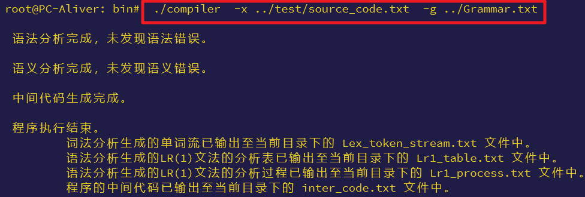
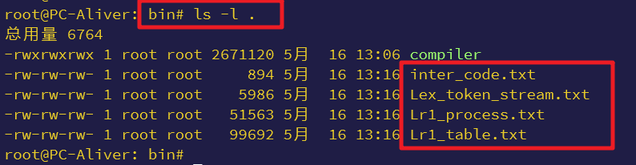
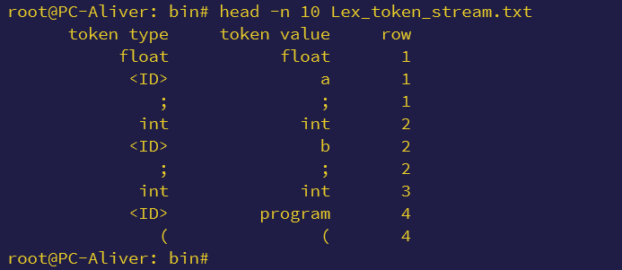
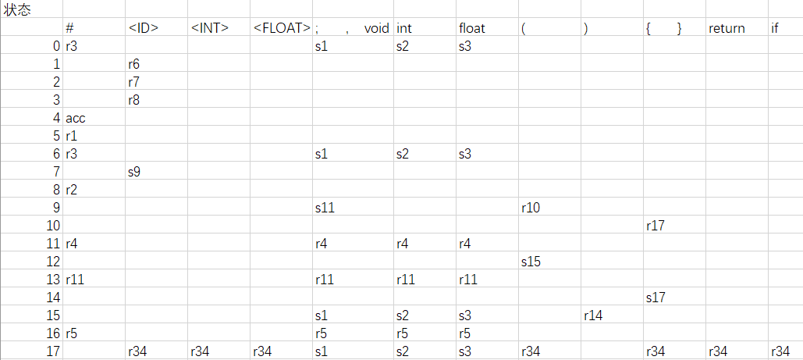
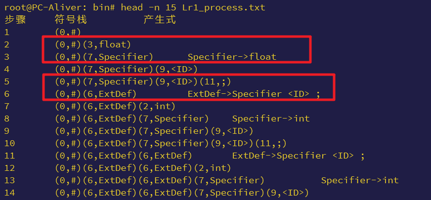

## mini-c-compiler

### 构建

使用 `cmake` 作为构建工具，流程如下：
```bash
> cd build/
> cmake ../
> make
> cd ../
> ls bin/
```
完成后，执行 `ls bin/` 命令，查看可执行文件是否生成：
```bash
root@PC-Aliver:compiling# ls -l bin/
总用量 2612
-rwxrwxrwx 1 root root 2674120 5月  16 10:56 compiler
```

### 运行

在 `bin/` 目录下执行程序，查看分析过程及结果：
```bash
> cd bin/
> ./compiler  -x ../test/source_code.txt  -g ../Grammar.txt
```
输出结果：



保存分析中间结果的文件：



### 分析结果

- 词法分析输出的字符流：


- LR(1)语法分析表：(用excel打开以便查看)


- LR(1)分析过程：


- 中间代码：
```txt
label : operate, arg1, arg2, result
1 : program, -, -, -
2 : :=, 0, -, i
3 : +, b, c, T0
4 : j>, a, T0, 7
5 : :=, 0, -, T1
6 : j, -, -, 8
7 : :=, 1, -, T1
8 : j=, T1, 0, 15
9 : j, -, -, 10
10 : *, b, c, T2
11 : +, T2, 1, T3
12 : +, a, T3, T4
13 : :=, T4, -, j
14 : j, -, -, 16
15 : :=, a, -, j
16 : j<=, i, 100, 19
17 : :=, 0, -, T5
18 : j, -, -, 20
19 : :=, 1, -, T5
20 : j=, T5, 0, 25
21 : j, -, -, 22
22 : *, j, 2, T6
23 : :=, T6, -, i
24 : j, -, -, 16
25 : :=, i, -, program_ret_val
26 : return, -, -, program
27 : demo, -, -, -
28 : :=, a, -, a
29 : +, a, 2, T7
30 : *, a, 2, T8
31 : :=, T8, -, demo_ret_val
32 : return, -, -, demo
33 : main, -, -, -
34 : :=, b, -, a
35 : +, a, c, T9
36 : param, c, -, -
37 : call, demo, -, T10
38 : param, T10, -, -
39 : param, b, -, -
40 : param, a, -, -
41 : call, program, -, T11
42 : :=, T11, -, c
43 : :=, 0, -, main_ret_val
44 : return, -, -, main
```
